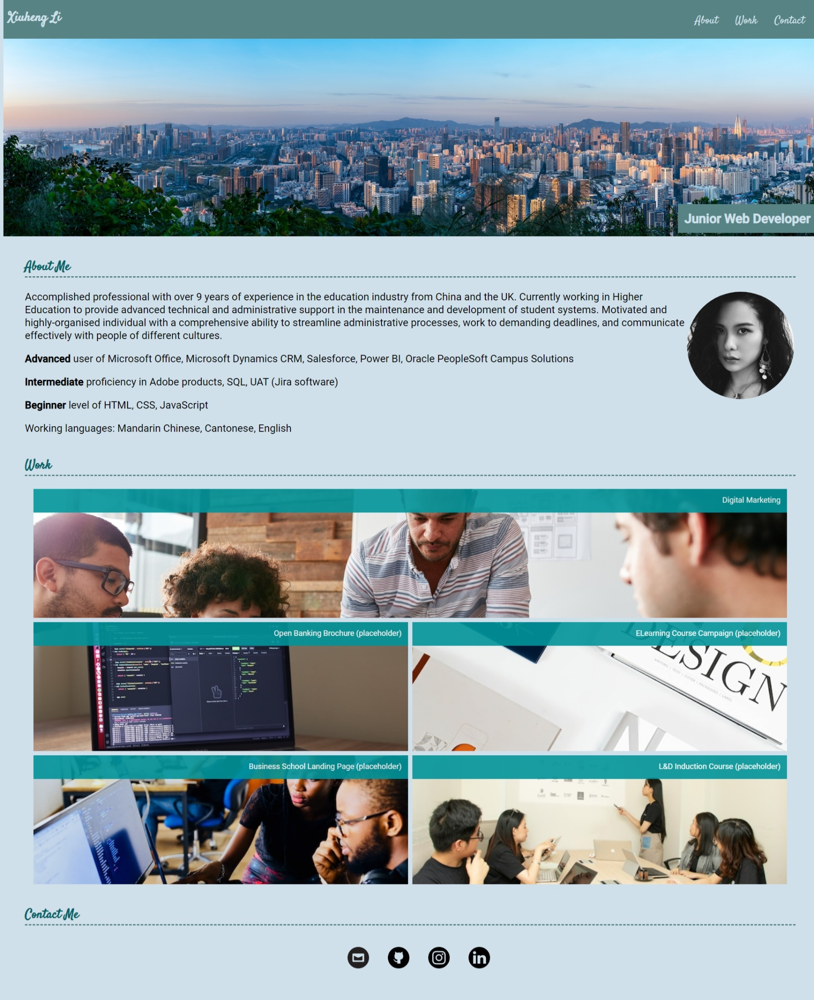
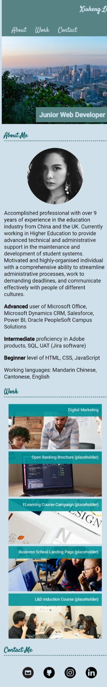

# Module Challenge - Portfolio
## Description
This project is to build a portfolio.
Unlike module 1 challenge, this time I got to design my own portfolio with more freedom in the properties I preferred. After this project, I look forward to learning more in the future, because I realize what the combination of elements and the potential of creative design could be only using the knowledge I have at week 2.
During the Thanksgiving break, I spent the whole week digging deeper into the things we have learned so far, by studying a LinkedIn Learning course. From the course, resources were also provided to help design content better (resources listed in Credits section). A little break in between prepared me for the upcoming sessions. 
However, I do understand the limit of my design this time – there is still a lot of room for improvement in terms of the aesthetics. When I usually design web content (slides, artwork, pages), I tend to draw them on paper or iPad, before delivering it on computer. Even though I managed to find the preferred color scheme, it still isn’t very pleasing, or it isn’t fully aligned with my vision (on paper) yet. And this will push me to find out more about UX/UI design methodologies in the future. 
When I was working out the navigation bar, I also noticed that choosing properties for the 'ul' or 'li' tags constantly took me time to figure out their margin/background issues, flex/block usage, etc., which will be something I need to review this week in my own time.

Link to the repository:
https://github.com/leesoohang/module2-portfolio.git

Link to the live application:
https://leesoohang.github.io/module2-portfolio

## Installation
N/A

## Usage
The application can be found as ‘index.html’ under the parent folder in the repository. The pictures used in the application be found in the ‘image’ folder, stylesheet in ‘css’ folder.

The screenshots of the live application:

## Credits
CSS Essential Training by Christina Truong on LinkedIn Learning:
https://www.linkedin.com/learning-login/share?account=74653818&forceAccount=false&redirect=https%3A%2F%2Fwww.linkedin.com%2Flearning%2Fcss-essential-training-22688362%3Ftrk%3Dshare_ent_url%26shareId%3DcI7lcqtyQ1%252BBhgAhXkariQ%253D%253D

I’ve had this course sat in my collection for a long time alongside others in the LinkedIn Learning Path ‘Become a Software Developer’. I’m very glad it became so timely and handy – the resources it mentioned help me outline and design with efficiency.

Icons used in the application (free to use):
https://www.iconfinder.com/

Placeholder images used in the application (free to use):
https://unsplash.com/

Color inspirations and palette selected in the application (Tidal Wave):
https://www.canva.com/colors/

Fonts used in the application (Google Fonts):
Roboto: https://fonts.google.com/specimen/Roboto
Satisfy: https://fonts.google.com/specimen/Satisfy
